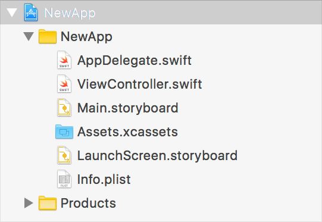
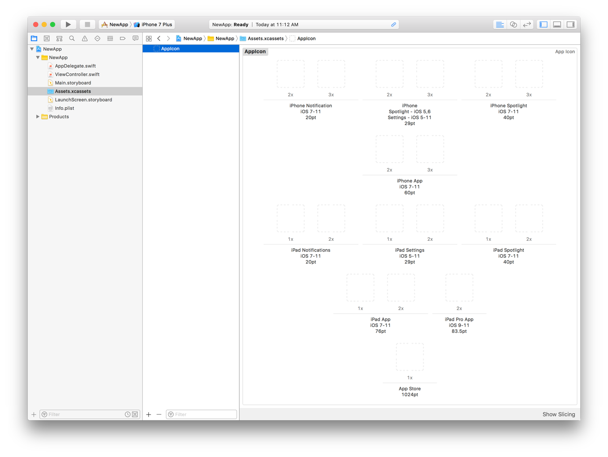
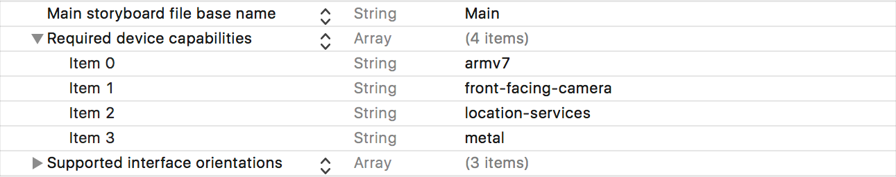

- [UIKit](dash-apple-api://load?request_key=csuikit) 
- 关于使用UIKit开发应用程序

文章

# 关于使用UIKit开发应用程序

Language

- Swift
- [Objective-C](dash-apple-api://load?topic_id=2928565&language=occ)

了解 uikit 和 xcode 为您的 ios 和 tvOS 应用提供的基本支持。

------

## 概述

uikit 框架提供了为 ios 和 tvOS 构建应用程序所需的核心对象。您可以使用这些对象在屏幕上显示内容, 与该内容进行交互, 并管理与系统的交互。应用的基本行为依赖于 uikit, uikit 为您提供了多种自定义行为以满足特定需求的方法。

重要

您总是通过在苹果的集成开发环境 xcode 中创建项目来开始开发 ios 或 tvOS 应用。如果您没有 xcode, 则可以从应用商店下载它。您也可以从 [developer.apple.com] 下载最新版本 (http://developer.apple.com/)。

xcode 提供模板项目作为您创建的每个应用的起点。例如, [图 1](dash-apple-api://load？topic_id=2928565&language=swift#3004316) 显示了使用 xcode 中的单个视图应用模板创建的应用的结构。模板项目提供了最小的用户界面, 因此您可以立即生成和运行项目, 并在设备或模拟器中查看结果。

图1

单一视图 ios 应用的结构

生成应用时, xcode 会编译源文件, 并为项目创建应用包。应用捆绑是一个结构化目录, 包含与应用关联的代码和资源. 资源包括支持您的代码的图像资产、情节提要文件、字符串文件和应用元数据。应用包的结构很重要, 但 xcode 知道你的资源需要去哪里, 所以现在不用担心。

### 所需资源

每个 uikit 应用都需要具有以下资源:

- App icons
- Launch screen storyboard

系统在主屏幕、"设置" 中以及将你的应用与其他应用区分开来所需的任何位置显示你的应用图标。因为它在多个位置和多个设备上使用, 所以你可以在 xcode 项目的 appicon 图像资产中提供多个版本的应用图标。你的应用图标应该是与众不同的, 以帮助用户在主屏幕上快速识别你的应用。但是, 您可能会更改图标的详细信息, 以适应必须提供的不同图像大小。

图2

为 ios 应用提供图标

 `LaunchScreen.storyboard` f文件包含你的应用的初始用户界面, 它可以是初始屏幕或实际界面的简化版本。当用户点击你的应用图标时, 系统会立即显示你的启动屏幕, 让你的应用现在正在启动的用户。启动屏幕还为你的应用提供了覆盖, 同时它也会自我初始化。当你的应用准备就绪时, 系统会隐藏启动屏幕并显示你的应用的实际界面。

### 所需的应用程序元数据

系统从应用包中的信息属性列表 (`Info.plist`) 文件中派生有关应用的配置和功能的信息。xcode 在每个新项目模板中都提供了此文件的预配置版本, 但您可能需要在某个时候修改此文件。例如, 如果你的应用依赖于特定的硬件, 或使用特定的系统框架, 则可能需要将与这些功能相关的信息添加到此文件中。

您可以对 `Info.plist`文件进行的一个常见修改是声明应用的硬件和软件要求。这些要求是你与系统通信你的应用需要运行的内容的方式。例如, 导航应用可能需要 gps 硬件的存在来提供逐圈方向。应用商店可防止应用安装在不符合应用要求的设备上。

图3

声明应用的硬件和软件要求

有关可包含在 `Info.plist`文件中的密钥的信息, 请参阅[Information Property List Key Reference](https://developer.apple.com/library/archive/documentation/General/Reference/InfoPlistKeyReference/Introduction/Introduction.html#//apple_ref/doc/uid/TP40009247). 

### uikit 应用程序的代码结构

uikit 提供了许多应用的核心对象, 包括与系统交互、运行应用的主事件循环以及在屏幕上显示内容的对象。您可以按原样使用这些对象中的大多数, 或者只进行一些小的修改。了解要修改的对象以及何时修改这些对象对于实现应用至关重要。

uikit 应用程序的结构基于模型视图控制器 (mvc) 设计模式, 其中对象按用途划分。模型对象管理应用的数据和业务逻辑。视图对象提供数据的可视表示形式。控制器对象充当模型和视图对象之间的桥梁, 在适当的时间在它们之间移动数据。

[Figure 4](dash-apple-api://load?topic_id=2928565&language=swift#3004320) 表示 uikit 应用程序的一个相当典型的结构。提供表示应用数据结构的模型对象。uikit 提供了大多数视图对象, 但您可以根据需要为数据定义自定义视图。协调数据对象和 uikit 视图之间的数据交换是视图控制器和应用委托对象。

图4

核心应用对象

uikit 和 foundation 框架提供了许多用于定义应用模型对象的基本类型。uikit 提供了一个[`UIDocument`](dash-apple-api://load?topic_id=1619970&language=swift) 对象, 用于组织属于基于磁盘的文件中的数据结构。基础框架定义表示字符串、数字、数组和其他数据类型的基本对象。 [`Swift Standard Library`](dash-apple-api://load?topic_id=2984803&language=swift) 提供了基础框架中提供的许多相同类型。

uikit 提供了控制器中的大多数对象和应用程序的视图层. 具体而言, uikit 定义了 [`UIView`](dash-apple-api://load?topic_id=1622655&language=swift)类, 它通常负责在屏幕上显示你的内容。(您还可以使用 "金属" 和其他系统框架将内容直接呈现到屏幕上。 [`UIApplication`](dash-apple-api://load?topic_id=1623037&language=swift) 对象运行应用的主事件循环, 并管理应用的整个生命周期。